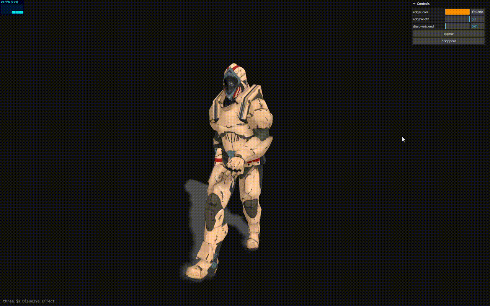

# three-practical-cases

# What is this lib?
A lib contains practical use cases using three.js and relative.

# How to run
I hate build up a node project even for simple experiment, so all the examples will be designed as a stand-alone case and simply using live-server to run.

run: 
- `git clone https://github.com/wwjll/three-practical-cases.git`
- `npm i`
- `install `live-server` plugin to start`

or you can use online cases.

# Introduction

- **Dissolve**
  A simple case to extend three.js shader using `onBeforeCompile`, you may experience using 2 different shaders.

  

# Examples

  - [Dissolve](https://wwjll.github.io/three-practical-cases/examples-io/DissolveEffect.html)